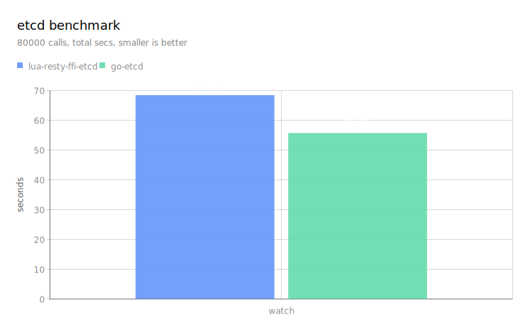

# lua-resty-ffi-etcd

The openresty etcd client library.

It encapsulates the etcd official [go client library](https://pkg.go.dev/go.etcd.io/etcd/client/v3).

## Background

If you access etcd directly using bare HTTP/GRPC, you will face the following problems:

* [smart load balancer](https://etcd.io/docs/v3.5/learning/design-client/) for multi-node etcd clusters
  * Sync cluster membership changes, e.g. replace a stale node
  * Full-featured node health check based on etcd client design
  * Conditional retry
* Compose low-level APIs to do some high-level stuff like authentication
* Lack of support for additional features like [grpc-proxy](https://etcd.io/docs/v3.5/op-guide/grpc_proxy/#client-endpoint-synchronization-and-name-resolution)
* Keep up-to-date with etcd official server changes and fix bugs yourself

Since etcd has an brilliant and active official go client, why not encapsulate it so that we could reuse it in openresty?

[lua-resty-ffi](https://github.com/kingluo/lua-resty-ffi) provides an efficient and generic API to do hybrid programming
in openresty with mainstream languages (Go, Python, Java, Rust, Nodejs).

`lua-resty-ffi-etcd = lua-resty-ffi + go-etcd`

## Synopsis

```lua
local etcd = require("resty.ffi.etcd")
local inspect = require("inspect")

local client = etcd.new{
    endpoints = {
        "httpbin.local:2379",
    },
}
local watch = client:watch{
    key = "/apisix/",
    is_prefix = true,
}
local ok, res = watch:recv()
assert(ok, "watch:recv failed")
ngx.say(inspect(res))
```

## Demo

```bash
# install lua-resty-ffi
# https://github.com/kingluo/lua-resty-ffi#install-lua-resty-ffi-via-luarocks
# set `OR_SRC` to your openresty source path
luarocks config variables.OR_SRC /tmp/tmp.Z2UhJbO1Si/openresty-1.21.4.1
luarocks install lua-resty-ffi

cd /opt
git clone https://github.com/kingluo/lua-resty-ffi-etcd
cd /opt/lua-resty-ffi-etcd
make

cd /opt/lua-resty-ffi-etcd/demo

# run nginx
LD_LIBRARY_PATH=/opt/lua-resty-ffi-etcd:/usr/local/lib/lua/5.1 \
nginx -p $PWD -c nginx.conf

# in another terminal, run demo
curl localhost:20000/demo/watch
```

### Benchmark



https://github.com/kingluo/etcd-benchmark

The overhead of encapsulation is approximately `20%`. Of course, there is improvement room.

